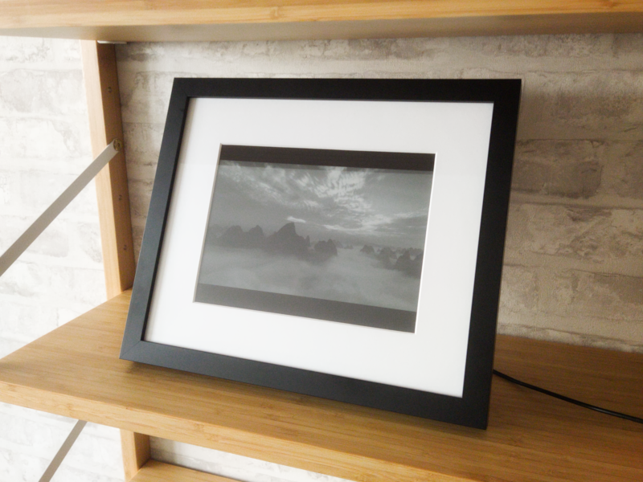
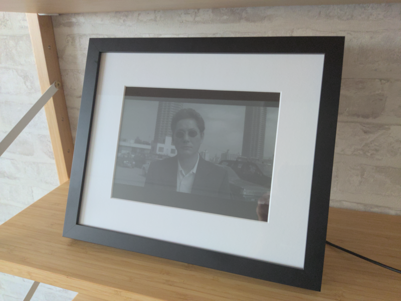
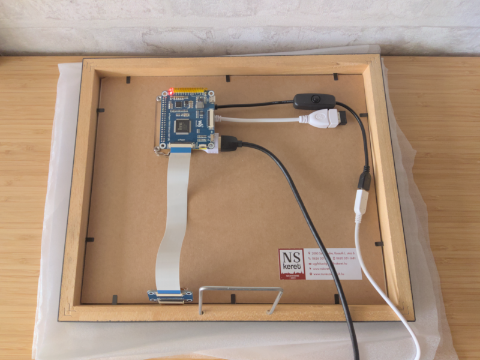
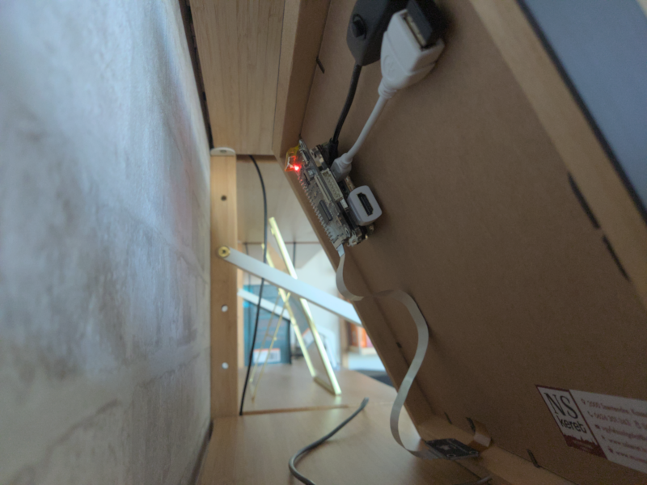
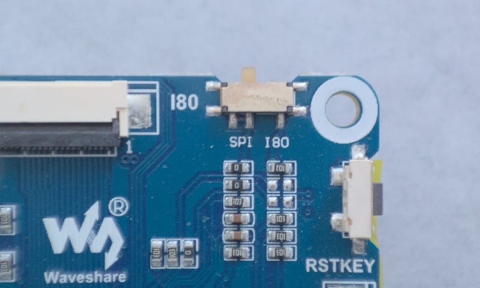
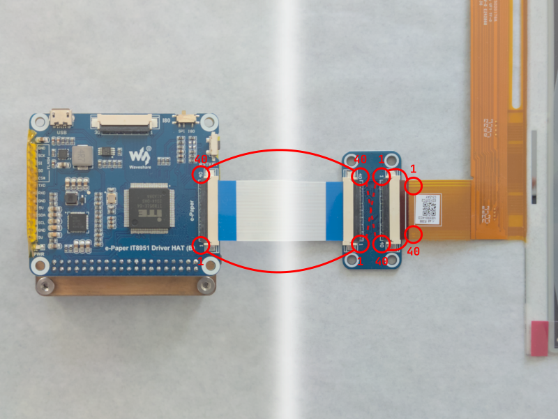
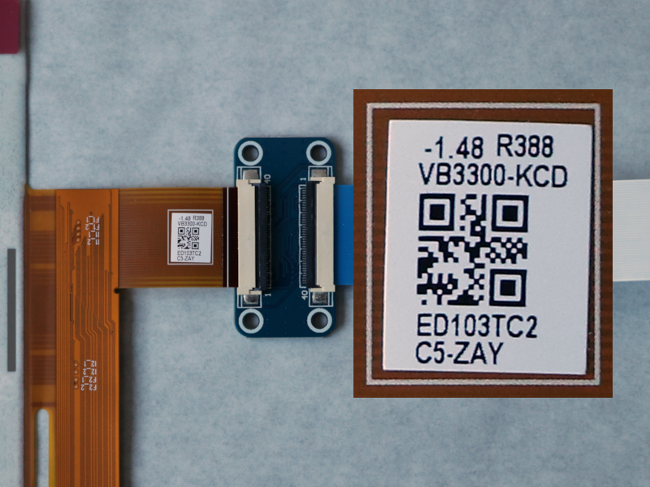

# slow-movie-frame-10.3

A picture frame enclosing an e-paper device which plays movies in a very slow manner.

[](docs/img/slow_movie_frame_1.png)

## Contents

* [About](#about)
* [License](#license)
* [Prerequisites](#prerequisites)
  * [Hardware prerequisites](#hardware-prerequisites)
  * [Operating system](#operating-system)
  * [Software packages](#software-packages)
* [Get slow-movie-frame-10.3](#get-slow-movie-frame-103)
* [Configuration](#configuration)
  * [`vcom`](#vcom)
  * [`display_resolution`](#display_resolution)
  * [`refresh_timeout`](#refresh_timeout)
  * [`video_directory`](#video_directory)
  * [`frame_skip` & `time_skip`](#frame_skip--time_skip)
  * [`grayscale_method`](#grayscale_method)
* [Installation](#installation)
* [Tests](#tests)
* [Acknowledgements](#acknowledgements)

## About

The scope/goal of this project was to create a picture frame enclosing an e-paper device which plays movies in a very slow manner.

[](docs/img/slow_movie_frame_2.png)

This project was inspired by [Tom Whitwell's Very Slow Movie Player](https://hackaday.com/2020/08/23/e-paper-display-shows-movies-very-very-slowly/) which I have read about on Hackaday. Ever since, I wanted to create my own. So, eventually, I did.

To achieve the goal, a [Waveshare 10.3 inch 16 gray scale color e-paper device][waveshare-10.3-inch-16-gray-scale-color-epaper-device] and a [Raspberry Pi Zero 2 W][raspberry-pi-zero-2-w] with [Raspberry Pi OS][raspberry-pi-os] for operating system were chosen.

While the software can be modified to run on different hardware and operating systems, doing so is out of the scope of this project.

[](docs/img/slow_movie_frame_3.png)

The physical picture frame was made by [Nagy Sándor Képkeretező Műhely és Művészbolt](nagy-sandor-kepkeretezo-muhely-es-muveszbolt) as I do not have the required tools and expertise create such a wonderful frame.

[](docs/img/slow_movie_frame_4.png)

The project is structured in the following directories:

| Directory                                                              | Description                                                                                                                                                          |
| ---------------------------------------------------------------------- | -------------------------------------------------------------------------------------------------------------------------------------------------------------------- |
| __[`build`](build)__                                                   | Directory meant to contain the compiled binaries of `update-display` and its tests.                                                                                  |
| __[`docs/img`](docs/img)__                                             | Directory containing images for this README.                                                                                                                         |
| __[`fixups`](fixups)__                                                 | Directory containing all non-source files (e.g. systemd service unit file, service configuration).                                                                   |
| __[`src/slow-movie-player-service`](src/slow-movie-player-service)__   | Python sources of the Slow Movie Player systemd service.                                                                                                             |
| __[`src/update-display`](src/update-display)__                         | C sources of `update-display`.                                                                                                                                       |
| __[`test/slow-movie-player-service`](test/slow-movie-player-service)__ | Tests for Slow Movie Player.                                                                                                                                         |
| __[`test/update-display`](test/update-display)__                       | C sources of the tests for `update-display`.                                                                                                                         |
| __[`vendor/easy-install-bcm2835`](vendor/easy-install-bcm2835)__       | Submodule containing an [easy-to-use installer for Mike McCauley's bcm2835 C library](https://github.com/szantaii/easy-install-bcm2835) (required by IT8951-ePaper). |
| __[`vendor/IT8951-ePaper`](vendor/IT8951-ePaper)__                     | Submodule containing [C library for Waveshare's e-paper devices driven by IT8951](https://github.com/szantaii/IT8951-ePaper) (required by `update-display`).         |

## License

This project is licensed under the MIT license. For the full license, please see [`LICENSE`](LICENSE).

## Prerequisites

### Hardware prerequisites

__:warning: Make sure that your Raspberry Pi is turned off and disconnected from any power source before connecting the e-paper driver board and screen.__

* [Waveshare 10.3 inch 16 gray scale color e-paper device][waveshare-10.3-inch-16-gray-scale-color-epaper-device] with IT8951 driver board (SKU: 18434).
* [Raspberry Pi Zero 2 W][raspberry-pi-zero-2-w] with GPIO headers installed.
* The IT8951 driver board (of the e-paper device) installed to the GPIO header of the Raspberry Pi. (See the [Waveshare 10.3 inch e-Paper HAT Wiki][waveshare-10.3-inch-16-gray-scale-color-epaper-device-wiki] for details.)

* The IT8951 driver board switched to SPI mode.

  

* The e-paper screen connected to the driver board.

  

  Make sure that the cables are connected properly: note the numberings on the IT8951 driver board PCB, the ribbon cable, and the e-paper screen's FPC.

### Operating system

* Either the 32 or 64 bit version of [Raspberry Pi OS][raspberry-pi-os] (previously called Raspbian) installed on a large capacity microSD card. (It is recommended to use the Lite version of Raspberry Pi OS as no desktop is necessary for either setting up or running this project.)

* Working internet connection for the duration of setting up this project. (Wireless or wired via a (micro-)USB Ethernet adapter.)

  See the official Raspberry Pi configuration documentation [how-to setup a wireless internet connection from the command-line](https://www.raspberrypi.com/documentation/computers/configuration.html#wireless-networking-command-line).

* SPI interfacing enabled.

  See the official Raspberry Pi configuration documentation [how-to enable SPI interfacing (under Interfacing Options) using `raspi-config`](https://www.raspberrypi.com/documentation/computers/configuration.html#spi).

### Software packages

The following packages are required to run this project.

| Package               | Requirement description                                                                                               |
| --------------------- | --------------------------------------------------------------------------------------------------------------------- |
| __`build-essential`__ | Required by the [`vendor/easy-install-bcm2835`](vendor/easy-install-bcm2835) submodule and to build `update-display`. |
| __`coreutils`__       | Required by the [`vendor/easy-install-bcm2835`](vendor/easy-install-bcm2835) submodule.                               |
| __`findutils`__       | Required by the [`vendor/easy-install-bcm2835`](vendor/easy-install-bcm2835) submodule.                               |
| __`git`__             | Required to acquire this project with all of its submodules.                                                          |
| __`imagemagick`__     | Required by the Slow Movie Player Service for image processing.                                                       |
| __`python3-numpy`__   | Required by the Slow Movie Player Service for image processing.                                                       |
| __`python3-opencv`__  | Required by the Slow Movie Player Service for video processing.                                                       |
| __`tar`__             | Required by the [`vendor/easy-install-bcm2835`](vendor/easy-install-bcm2835) submodule.                               |
| __`wget`__            | Required by the [`vendor/easy-install-bcm2835`](vendor/easy-install-bcm2835) submodule.                               |

See the following commands for updating your Raspberry Pi OS and installing the necessary packages.

```console
sudo apt-get update                          \
    && sudo apt-get dist-upgrade --yes       \
    && sudo apt-get autoremove --purge --yes \
    && sudo apt-get autoclean                \
    && sudo apt-get clean                    \
    && sudo reboot
```

```console
sudo apt-get install build-essential coreutils findutils  \
    git imagemagick python3-numpy python3-opencv tar wget \
    -o APT::Install-Suggests=0                            \
    -o APT::Install-Recommends=0                          \
    --yes
```

## Get slow-movie-frame-10.3

To acquire this project use the following git command to clone this repository with all of its submodules:

```console
git clone --recurse-submodules https://github.com/szantaii/slow-movie-frame-10.3.git
```

## Configuration

The default configuration file ([`default.conf`](fixups/default.conf)) for the Slow Movie Player service can be found in the fixups directory. You can either edit the mentioned file or prepare your own configuration file for the Slow Movie Player service, however if the second approach is taken, then the [`setup.sh`](setup.sh) script must be modified to copy the custom configuration file, or it has to be placed manually.

Mandatory options and their respective types:

| Option                                          | Type               |
| ----------------------------------------------- | ------------------ |
| __[`vcom`](#vcom)__                             | float              |
| __[`display_resolution`](#display_resolution)__ | string             |
| __[`refresh_timeout`](#refresh_timeout)__       | non-negative float |
| __[`video_directory`](#video_directory)__       | string             |

Optional options and their respective types:

| Option                                      | Type             |
| ------------------------------------------- | ---------------- |
| __[`frame_skip`](#frame_skip--time_skip)__  | positive integer |
| __[`time_skip`](#frame_skip--time_skip)__   | positive float   |
| __[`grayscale_method`](#grayscale_method)__ | string           |

### `vcom`

(Mandatory option, floating point number.)

This is the voltage for the connected e-paper device.

__:warning: Read and use the exact voltage from the flexible, printed circuit cable of the connected device.__



### `display_resolution`

(Mandatory option, string.)

This is the resolution of the connected e-paper device.

Specify the string value in one of the following formats:

* `1872 1404`
* `1872x1404`
* `1872 x 1404`
* `1872X1404`
* `1872 X 1404`
* `1872, 1404`
* `1872; 1404`

You may enclose the value between single or double quotes (e.g. `'1872 x 1404'`) but it is not necessary.

### `refresh_timeout`

(Mandatory option, non-negative floating point number.)

This is the amount of time (measured in seconds) while a single frame will be on the screen before advancing to the next one.

### `video_directory`

(Mandatory option, string.)

This is the absolute path to the directory which contain the videos you want to play with the Slow Movie Player Service.

You may enclose the value between single or double quotes (e.g. `"/path/to/video/directory"`) but it is not necessary.

### `frame_skip` & `time_skip`

(`frame_skip`: optional, positive integer.)\
(`time_skip`: optional, positive floating point number.)

`frame_skip` is the amount of frames to advance in the video when advancing to the next frame to display. (Measured in number of frames.)

`time_skip` is the amount of time, measured in milliseconds, to advance in the video when advancing to the next frame to display. (Measured in milliseconds.)

By adjusting these settings you may control how long the playback of videos will take with the Slow Movie Player Service.

`frame_skip` and `time_skip` are optional settings, so you may comment them out, in that case the Slow Movie Player Service will display all frames in videos. (Equivalent with specifying `frame_skip = 1`.)

If both `frame_skip` and `time_skip` options are set, then the `time_skip` option will take effect.

See the following examples for different playback durations with different `frame_skip` and `time_skip` settings.

#### Example #1

Take a video with a 24 frames per second frame rate and with a 90 minute duration, `frame_skip` set to 1 with [`refresh_timeout`](#refresh_timeout) set to 300.0 seconds (5 minutes).

In this case, the playback would roughly take up 90 × 60 × 24 × 300.0 seconds, or 450 days, or 1 year, 12 weeks and 1 day.

#### Example #2

Take the same video and `refresh_timeout` setting as in [Example #1](#example-1), but set `frame_skip` to 3.

In this case the playback would take up (90 × 60 × 24) / 3 × 300.0 seconds which is only 150 days, or 21 weeks and 3 days.

#### Example #3

Take a 45 minute video with a 48 frames per second frame rate and another 45 minute long video with a 29.97 frames per second frame rate, [`refresh_timeout`](#refresh_timeout) set to 300.0 seconds (5 minutes) and `time_skip` set to 100.0 milliseconds.

In this case the total playback time of the two videos would take (45 + 45) × 60 × (1000 / 100.0) × 300.0 seconds, which is 26 weeks, 5 days and 12 hours.

Also note that the frame rate of the videos did not affect the total playback time in this case.

#### Further examples

* __`frame_skip = 1`:__ Every frame will be displayed.
* __`frame_skip = 2`:__ Only every other frame will be displayed.
* __`frame_skip = 10`:__ Only every tenth frame will be displayed.
* __`time_skip = 100.0`:__ A frame of every tenth of a second of the video will be displayed.

### `grayscale_method`

(Optional, string.)

This is the grayscale method which is applied to a video frame when applying Floyd-Steinberg dithering (along with a 4 bits per pixel color map).

Valid options are the following: `Rec601Luma`, `Rec601Luminance`, `Rec709Luma`, `Rec709Luminance`, `Brightness`, `Lightness`, `Average`, `RMS`.

See the following photo and the table below to see the effects of the different grayscale methods when creating 16 color dithered grayscale images.


The original photo is titled Two macaws, it was taken by Steve Kelly at Maui, Hawaii, USA on KODACOLOR Gold 100 Plus (35mm). (The original photo is Image #23 (Ref#JN1033) on the Kodak Photo CD Photo Sampler released by the Eastman Kodak Company.)

| Grayscale method      | Produced image                                                      |
| --------------------- | ------------------------------------------------------------------- |
| __`Rec601Luma`__      |       |
| __`Rec601Luminance`__ |  |
| __`Rec709Luma`__      |       |
| __`Rec709Luminance`__ |  |
| __`Brightness`__      |       |
| __`Lightness`__       |        |
| __`Average`__         |          |
| __`RMS`__             |              |

All the images above were generated using [ImageMagick](https://imagemagick.org/) with the following “one-liner”:

```bash
printf '%s\n' 'P2' '16 1' '255' '0' '17' '34' '51' '68' '85' '102' '119' '136' '153' '170' '187' '204' '221' '238' '255' > gray_palette.pgm && convert 'IMG0023.tif' -filter lanczos -resize 512x 'IMG0023_512x341.png' && for grayscale_method in 'Rec601Luma' 'Rec601Luminance' 'Rec709Luma' 'Rec709Luminance' 'Brightness' 'Lightness' 'Average' 'RMS' ; do convert 'IMG0023.tif' -filter lanczos -resize 512x -grayscale "${grayscale_method}" -dither FloydSteinberg -remap gray_palette.pgm "IMG0023_512x341_grayscale_${grayscale_method}_16grays.png" ; done
```

For further details about the grayscale methods, please see:

* [ImageMagick Examples – Color Modifications – Converting Color to Gray-Scale](https://imagemagick.org/Usage/color_mods/#grayscale)
* [ImageMagick – Annotated List of Command-line Options – grayscale](https://imagemagick.org/script/command-line-options.php?#grayscale)
* [ImageMagick – Annotated List of Command-line Options – intensity](https://imagemagick.org/script/command-line-options.php?#intensity)

`grayscale_method` is optional, so you may comment out this setting. In this case the default `Rec709Luma` grayscale method will be used.

You may enclose the value between single or double quotes (e.g. `'Rec601Luminance'`) but it is not necessary.

## Installation

1. Install Mike McCauley's bcm2835 C library.

   This library is necessary to build `update-display`.

   ```console
   sudo ./vendor/easy-install-bcm2835/setup.sh -i
   ```

   In case you would like to remove slow-movie-frame-10.3 from your Raspberry Pi and do not need the bcm2835 C library anymore, run the same script with the `-u` switch to uninstall it.

   ```console
   sudo ./vendor/easy-install-bcm2835/setup.sh -u
   ```

   For further information on the [`vendor/easy-install-bcm2835`](vendor/easy-install-bcm2835) submodule, see its [`README.md`](vendor/easy-install-bcm2835/README.md) file.

2. Compile `update-display`.

   ```console
   cd ./src/update-display \
       && make             \
       && cd ../..
   ```

3. Install the Slow Movie Player Service.

   This will install the Slow Movie Player Python sources and C binary under `/opt`, the service configuration under `/etc`, register the Slow Movie Player systemd service and enable it.

   ```console
   sudo ./setup.sh -i
   ```

   In case you would like to remove slow-movie-frame-10.3 from your Raspberry Pi, run the same script with the `-u` switch to uninstall it.

   ```console
   sudo ./setup.sh -u
   ```

4. Add videos.

   Create the directory you specified in [`video_directory`](#video_directory) and add the video files, which you would like the Slow Movie Player Service to play, into the directory.

5. Disable internet connection (optional).

   Since there is no further need for a working internet connection after this point, it is recommended to disable it.

   See the following command to create a backup of your Raspberry Pi's `config.txt` file and to completely disable Bluetooth and Wi-Fi connections after a fresh boot on the Raspberry Pi.

   ```console
   sudo sed -i.bak                                                                           \
       '$a \\n# Disable Bluetooth and Wi-Fi\ndtoverlay=disable-bt\ndtoverlay=disable-wifi\n' \
       /boot/config.txt
   ```

   For further details about the settings used in the command above see [Device Trees, Overlays, and Parameters](https://www.raspberrypi.com/documentation/computers/configuration.html#device-trees-overlays-and-parameters) in the official Raspberry Pi documentation and [this README](https://github.com/raspberrypi/firmware/blob/master/boot/overlays/README) about the specific options used.

6. Reboot the Raspberry Pi.

   When the Raspberry Pi is rebooted Slow Movie Player Service will start to display video frames on the connected e-paper device after 60 seconds.

## Tests

To run the tests for `update-display` you will have to compile and run them:

```console
cd ./test/update-display \
    && make              \
    && cd ../..          \
    && ./build/test-update-display
```

To run the tests for the Slow Movie Player Service run the following Python script:

```console
./test/slow-movie-player-service/testrunner.py
```

## Acknowledgements

* Thanks to Mike McCauley for his [bcm2835 C library for the Raspberry Pi](https://www.airspayce.com/mikem/bcm2835/) as it provides a basis for a myriad of Raspberry Pi builds and projects.
* Thanks to Waveshare for providing [easy to understand demos and an easy to use library for their IT8951 e-paper devices](https://github.com/waveshare/IT8951-ePaper).
* Thanks to [Péter Rácz](https://github.com/petyaracz) for his help with reviews.
* Thanks to [Nagy Sándor Képkeretező Műhely és Művészbolt][nagy-sandor-kepkeretezo-muhely-es-muveszbolt] for their great work on the physical picture frame.
* Thanks to all the other e-paper frame builds which provided inspiration:
  * [Tom Whitwell's Very Slow Movie Player](https://debugger.medium.com/how-to-build-a-very-slow-movie-player-in-2020-c5745052e4e4) ([Hackaday article](https://hackaday.com/2020/08/23/e-paper-display-shows-movies-very-very-slowly/)),
  * [Bryan Boyer's Very Slow Movie Player](https://medium.com/s/story/very-slow-movie-player-499f76c48b62),
  * [likeabob's Slow Movie Player 7C](https://hackaday.io/project/184466-slow-movie-player-7c) ([Hackaday article](https://hackaday.com/2022/08/19/every-frame-a-work-of-art-with-this-color-ultra-slow-movie-player/)).

[waveshare-10.3-inch-16-gray-scale-color-epaper-device]: https://www.waveshare.com/product/displays/e-paper/epaper-1/10.3inch-e-paper-hat.htm
[waveshare-10.3-inch-16-gray-scale-color-epaper-device-wiki]: https://www.waveshare.com/wiki/10.3inch_e-Paper_HAT
[raspberry-pi-zero-2-w]: https://www.raspberrypi.com/products/raspberry-pi-zero-2-w/
[raspberry-pi-os]: https://www.raspberrypi.com/software/
[nagy-sandor-kepkeretezo-muhely-es-muveszbolt]: http://nskeret.hu/
